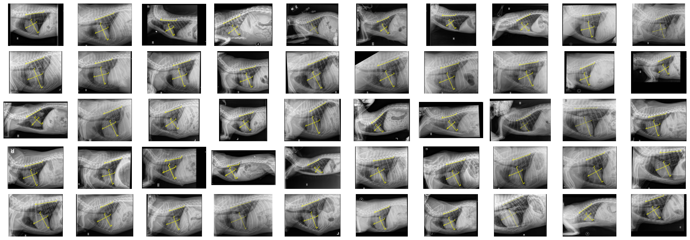
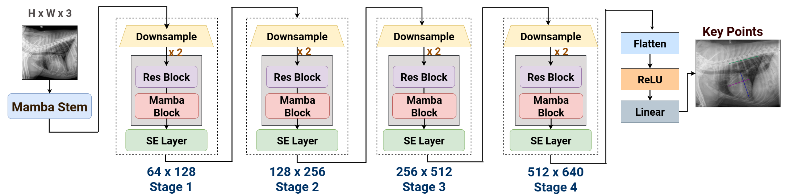
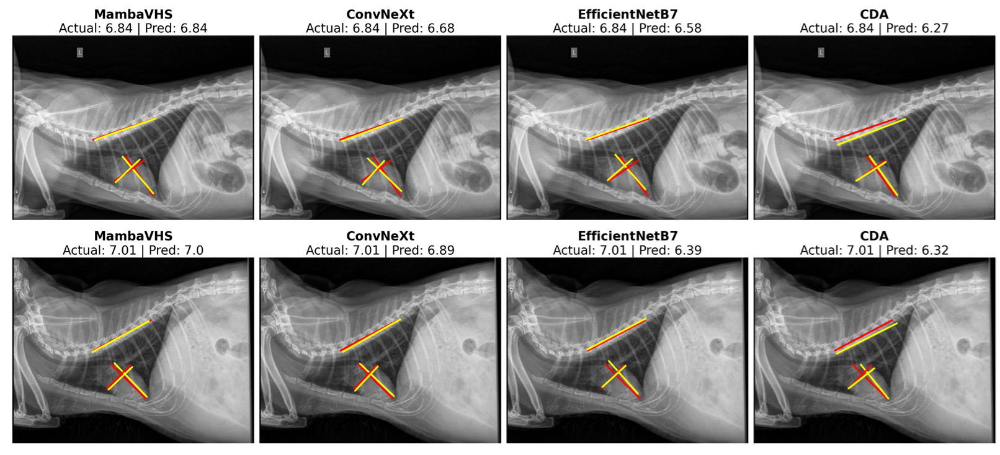
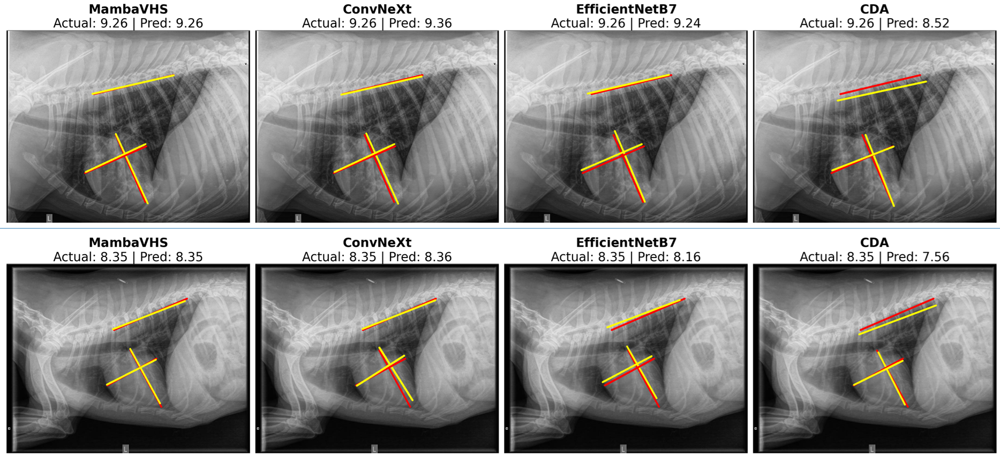
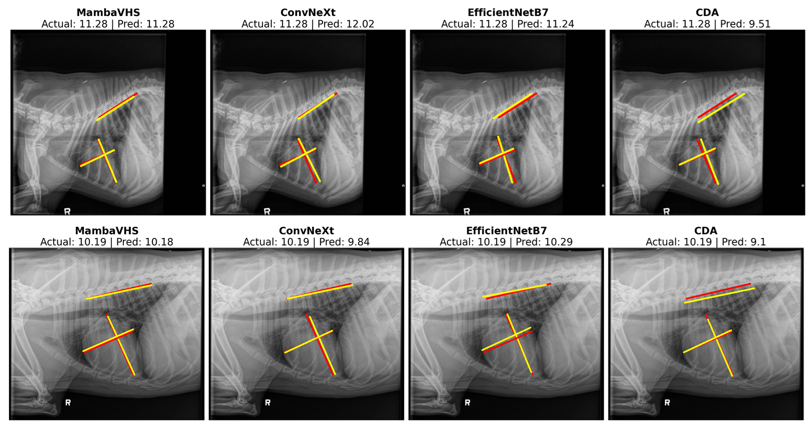

# VHSMarker and the CCK Dataset: A Benchmark for Automated Vertebral Heart Score Estimation in Canine Radiographs

🔗 Github Website URL : [https://anonymousgenai.github.io/vhsmarker/](https://anonymousgenai.github.io/vhsmarker/)


We present VHSMarker, a web-based annotation tool that enables rapid and standardized labeling of six cardiac key points in canine thoracic radiographs. VHSMarker reduces annotation time to 10–12 seconds per image while supporting real-time vertebral heart score (VHS) calculation, model-assisted prediction, and quality control. Using this tool, we constructed the Canine Cardiac Key Point (CCK) Dataset, a large-scale benchmark of 21,465 annotated radiographs from 12,385 dogs across 144 breeds and additional mixed breed cases, making it the largest curated resource for canine cardiac analysis to date. To demonstrate the utility of this dataset, we introduce MambaVHS, a baseline model that integrates Mamba blocks for long-range sequence modeling with convolutional layers for local spatial precision. MambaVHS achieves 91.8% test accuracy, surpassing 13 strong baselines including ConvNeXt and EfficientNetB7, and establishes state-space modeling as a promising direction for veterinary imaging. Together, the tool, dataset, and baseline model provide the first reproducible benchmark for automated VHS estimation and a foundation for future research in veterinary cardiology.

---

## 🚀 Key Contributions

### 🐾 CCK Dataset
- 21,465 annotated lateral-view X-rays.
- Standardized keypoint labels for AB, CD, and EF measurement.
- Export formats: JSON, CSV, and `.mat`.

### ✍️ VHSMarker Annotation Tool
- Real-time VHS calculation as keypoints are placed.
- Web-based with HTML5 Canvas for pixel-precise annotations.
- Instant ONNX-based model inference for predictions.

### 🧠 MambaVHS Model
- Combines convolutional layers with Mamba blocks for long-range spatial modeling.
- SE layers for channel-wise recalibration.
- Real-time prediction in under 42ms per image.

---

## 📁 Dataset Overview

| Split      | No. of Images | Percentage |
|------------|----------------|------------|
| Training   | 15,026         | 70%        |
| Validation | 2,155          | 10%        |
| Testing    | 4,275          | 20%        |
| **Total**  | **21,465**     | **100%**   |



Download the dataset from [Hugging Face](https://huggingface.co/datasets/gen-ai-researcher/vhs_dogheart_db).

---

## 🧠 Model Architecture

The MambaVHS model combines convolutional feature extractors with Mamba blocks and residual connections.



- Stem: Two 3×3 Conv layers with SiLU and BatchNorm
- Stages: Four blocks with Residual + Mamba + SE layers
- Regression Head: GlobalAvgPooling + Linear layers

---

## 🧪 Results

| Model             | Validation Acc | Test Acc |
|------------------|----------------|----------|
| GoogleNet        | 77.5%          | 74.8%    |
| ResNet50         | 80.0%          | 84.2%    |
| EfficientNetB7   | 88.21%         | 88.41%   |
| ConvNeXt         | 88.16%         | 89.4%    |
| MambaVHS         | **89.5%**      | **91.8%**|

---

## 📸 Prediction Examples

| VHS Category          | Sample Output |
|-----------------------|----------------|
| VHS < 8.2             |  |
| 8.2 ≤ VHS ≤ 10        |  |
| VHS > 10              |  |

Predictions are color-coded with ground truth (red) and model outputs (yellow).

---

## 📊 Ablation Study

| Model Variant                 | Val Acc | Test Acc | Notes                                  |
|------------------------------|---------|----------|----------------------------------------|
| Without SE Layers            | 88.0%   | 88.5%    | Channel recalibration matters          |
| With L1 Loss Only            | 88.4%   | 88.7%    | VHSAwareLoss improves accuracy         |
| With Attention + MLP         | 80.1%   | 84.7%    | Mamba improves efficiency & accuracy   |
| Without Residual Blocks      | 82.0%   | 84.5%    | Skip connections help retain features  |
| Full MambaVHS                | 89.5%   | 91.8%    | Best performing configuration          |

---

## 🧰 Technical Stack

- Frontend: HTML5, JS, Bootstrap 5
- Backend: Flask + OpenCV + Python
- Model Runtime: ONNX + PyTorch
- Export: JSON / CSV / `.mat`

---

## ▶️ Demo

Watch the [VHSMarker tool demonstration](docs/assets/VHS.mp4) showing:
- Keypoint placement (A–F)
- Real-time VHS calculation
- Window/Level feature demonstration
- MambaVHS predictions

---

## 📦 Installation

Download the model checkpoint from [Google Drive](https://drive.google.com/drive/u/7/folders/1Ry-pTgbOfpOEN8ZCbqnAKW5SP5kcOjji).
The file is located at :
```bash
checkpoints\\bm_15.pth
```

```bash
git clone https://github.com/anonymousgenai/vhsmarker.git
cd dog-vhs
pip install -r requirements.txt
flask run

---

## 🏋️ Training and Evaluation

To train the MambaVHS model on the CCK dataset, use the following command:
```bash
cd mamba_vhs
python train.py 
python evaluate.py

```

### Conclusion
The VHSMarker framework advances canine cardiac analysis through its efficient annotation tool (10-12s/image), comprehensive CCK dataset (21,465 images), and high-accuracy MambaVHS model (91.8% test accuracy, 42ms inference), establishing a new benchmark for automated veterinary diagnostics.
